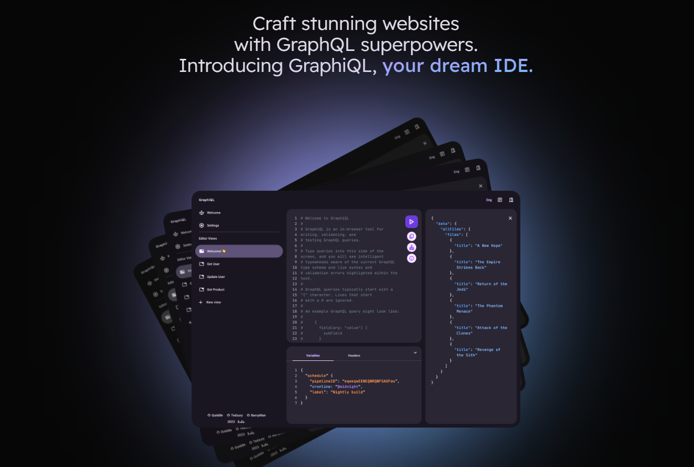
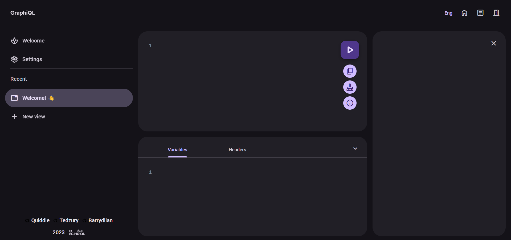
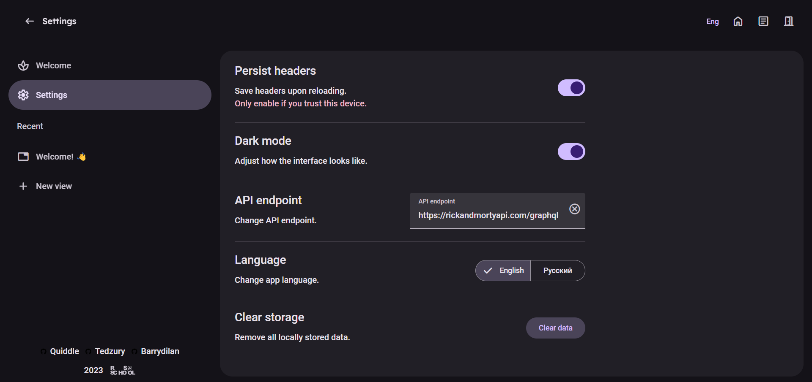
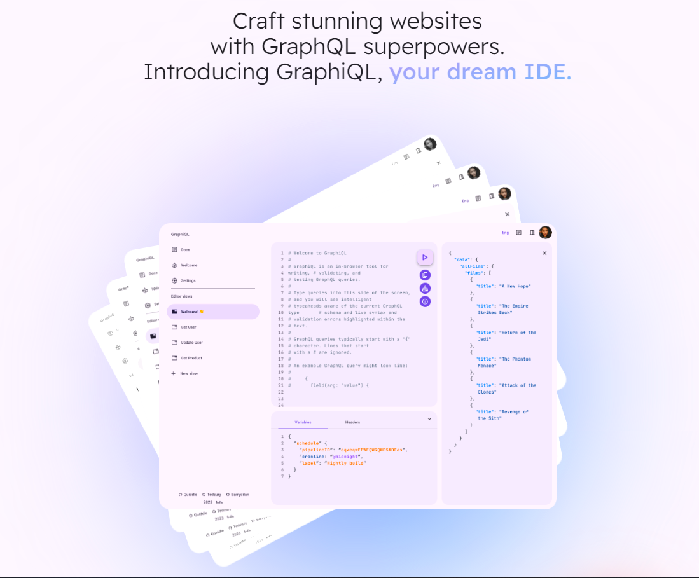
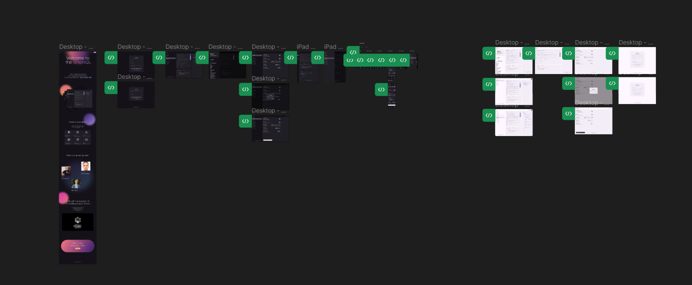
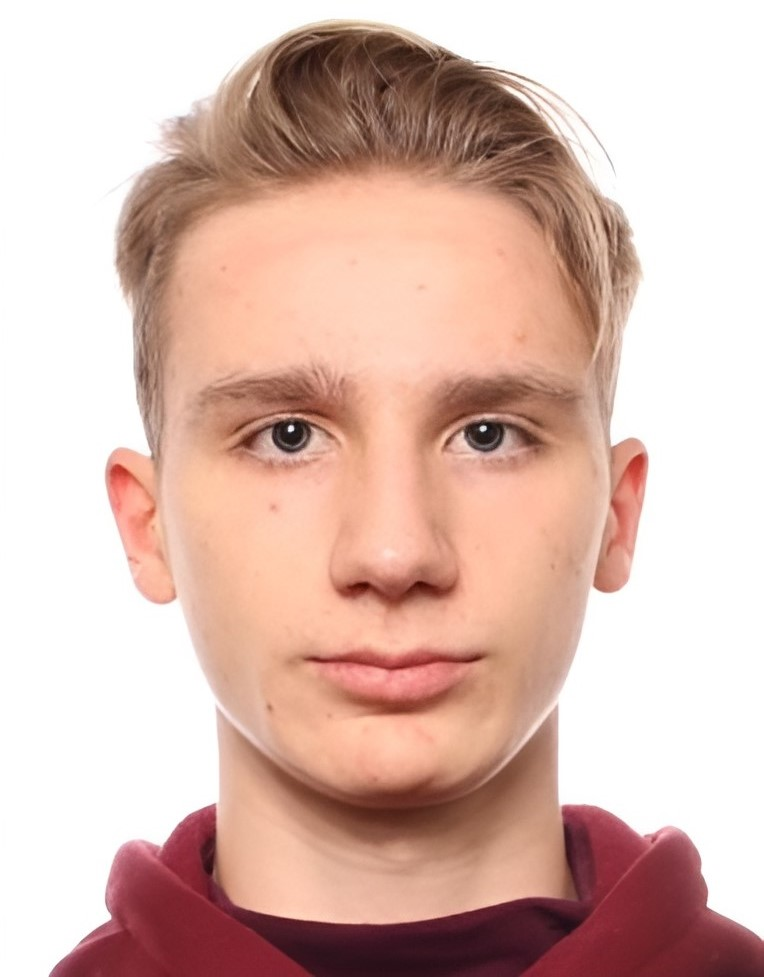
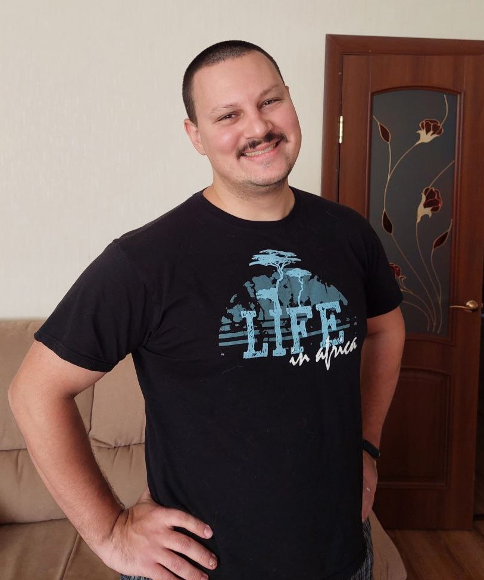

# ⚛️ GraphiQL App

🦥 RS-School React Final Task.

***GraphiQL:** Your interactive GraphQL IDE, empowering website development with syntax highlighting, autocompletion, and dynamic documentation 🤩.*

# Getting Started 🚀
To run our project locally, you would have to download zip file with our repository or clone it to your computer. ✨

## Setup and Running ⚠️

What things do you need to do in order to run our project locally? 🤔

* Use node 18.x or higher. ⚡
* Installed [.git](https://git-scm.com/) on your computer. ✌️
* Code Editor of your choice. 📝
* Installed [npm](https://www.npmjs.com/). 📦

## Installation And Preparation 🔮

First make sure you have all the things listed in the previous section. Then clone our repository to your computer: 👌

```
git clone https://github.com/Quiddlee/graphiql-app.git
```

or download zip file manually with our repository.

Navigate into project folder and run 📦:

```
npm install
```

Finally run a development server: 🤩
```
npm run dev
```
Aaaaand you're done! 🎉🥳

# Features 😍








## Available Scripts 🥑

Here you can find all the scripts that are available in our project. 🦚

Lint the App with **ESlint**: ✅

```
npm run lint
```

Format the App with **Prettier**: 🧹

```
npm run prettier:fix
```

Type check the App with **TypeScript**: 🦁

```
npm run type-check
```

Install **Husky** to enable pre-commit hooks: 🎣

```
npm run prepare
```

Run unit-tests with  **Vitest**: 🧪

```
npm run test
```

Run unit-tests coverage with  **Vitest**: 🧪

```
npm run coverage
```

**Build** project for production: 🎁

```
npm run build
```

**Preview** the **production build** locally: 👀

```
npm run preview
```

# Technology Stack ⚙️

## Developing 🦈
* **React.js** - The Web Framework used 💘
* **React** Router Dom - The Router 📍
* **TypeScript** - The Language 💖
* **Tailwind** - The CSS Framework 🍃
* **Vite** - The Bundler 📦
* **Material**/web - Material Design Web Components 💫
* **Firebase** - The Backend tooling 🔥

## Code Quality 🧹
* **Vitest** - The Test Runner 🧪
* **Testing** Library - The Testing Framework 🫂
* **React Testing Library** - The Testing Framework 🫂
* **ESLint** — Air-bnb base - The Linter 🔔
* **Prettier** - The Code Formatter 👏
* **Husky** - The Pre-commit Hooks 🪝
* **Lint Staged** - The Pre-commit Hooks Config 🦚
* **EditorConfig** - The Code Style Enforcer 😎
* **Clsx + Tailwind Merge** - The Tailwind Classnames Resolver 🎨

## External Libraries 📚
* **Yup** - The Form Validation Schema Builder 🏛️
* **React Hook Form** - The Form Library 📑
* **Framer** Motion - The Animation Library 😍
* **Codemirror** - The Code Editor 📝
* **Overlayscrollbars** - The Custom Scrollbar 📜
* **React Toastify** - The Toast Library 🍞

# App Design Guideline 🎨

The app is using the **Material Design 3** System aka **Material You**.

* **Figma** - The Design Tool 🎨
* **Design File** - [link](https://www.figma.com/file/2bUMq5pE5L91lJWB9S1jAX/GraphiQL-App-%F0%9F%9A%80?type=design&node-id=0%3A1&mode=design&t=v3gBWbiLESRO53BN-1)



# Core Development Team 👨‍💻

### **Bohdan Shcherbyna 🦁**

*Front-end. UI/UX Design.*



### Contact 👋:
* Email - ```bogdanscherbinadev@gmail.com``` 📬
* Linkedin - [Bohdan Shcherbyna](https://www.linkedin.com/in/quiddle/) ✒️
* Telegram - [@Quiddle](https://t.me/quiddle) 📱
* GitHub - [Quiddlee](https://github.com/Quiddlee) 🦉

#

### **Oleksii Drohachov** 🦈
*Front-end. Back-end.*



### Contact 👋:
* Email - ```asdrogachev@gmail.com``` 📬
* Linkedin - [Oleksii Drohachov](https://www.linkedin.com/in/oleksii-drohachov-b127a9245/) ✒️
* Telegram - [@Tedzury](https://t.me/tedzury) 📱
* GutHub - [Tedzury](https://github.com/Tedzury) 🦉

#

### **Harry Holubiev** 🐲
*Front-end.*


### Contact 👋:
* Email - ```queharambe@gmail.com``` 📬
* GitHub - [barrydilan](https://github.com/barrydilan) 🦉
